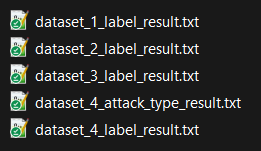

# Ariel Cyber Innovation Center <> Cisco competition

   


Competition Date 8/1 09:00 

Based on the M.Sc. work of Shmuel Lavian and part of the **API Traffic Research Dataset Framework** article

## Description

The goal of this challenge is to achieve the highest prediction scores while showing advanced data research capabilities in order to map out the right features in the best way fitting your machine learning model of choice. 

You will need to predict and classify malicious and benign API traffic utilizing your knowledge in data exploration and machine learning models. 

In some datasets you will be required to create a model that labels not only the attack but also the attack type.

## Datasets
API security contains four datasets each will be divided to Train (70%), Test (15%), and Validation (15%) while the train-test split will be done inside the code the validation split is gives without labels for later grading.

All the datasets contain HTTP traffic of API requests and responses. 

The datasets are:
1.	**Dataset_1** - The most basic API traffic containing the least number of attacks and endpoints. Will basically enable to have a soft start. 

```
Dataset 1 baseline score:

                   precision    recall  f1-score   support

    Benign          0.95715   0.93922   0.99792       480
    Malware         0.99799   0.94129   0.96881       528
    
    accuracy                            0.96825      1008
    macro avg       0.96860   0.96960   0.96824      1008
    weighted avg    0.97000   0.96825   0.96827      1008

```
2.	**Dataset_2** - A more advance version of the former dataset containing much more attacks and endpoint (almost double). The data is also more complex with a higher randomization mechanism.
```
Dataset 2 baseline score:

                  precision    recall  f1-score   support

    Benign          0.98455   0.99178   0.98815     20812
    Malware         0.88889   0.80851   0.84680      1692

    accuracy                            0.97800     22504
    macro avg       0.93672   0.90015   0.91747     22504
    weighted avg    0.97735   0.97800   0.97752     22504
```
3.	**Dataset_3** - Same as before but this time the dataset includes more complex parameters in any request making it more authentic but also making it much harder to simply "plug and play" on any machine learning model. According to the model you choose some of you may need to approach the data exploration and feature extraction differently.
```
Dataset 3 baseline score - Label phase:

                   precision    recall  f1-score   support

    Benign          0.95715   0.97607   0.96652     30209
    Malware         0.77364   0.65181   0.70752      3791

    accuracy                            0.93991     34000
    macro avg       0.86539   0.81394   0.83702     34000
    weighted avg    0.93669   0.93991   0.93764     34000
    
```

```
Dataset 3 baseline score - Attack Type phase:

                     precision    recall  f1-score   support

             Benign    0.95649   0.97705   0.96666     22659
   Cookie Injection    1.00000   0.99829   0.99914       584
Directory Traversal    0.17021   0.11511   0.13734       278
              LOG4J    0.87582   0.48201   0.62181       278
        Log Forging    0.33333   0.15194   0.20874       283
                RCE    0.98582   0.98582   0.98582       282
      SQL Injection    0.68499   0.58169   0.62913       557
                XSS    0.78584   0.74144   0.76300       584

           accuracy                        0.93966     25505
          macro avg    0.72406   0.62917   0.66395     25505
       weighted avg    0.93161   0.93966   0.93438     25505
```

4.	**Dataset_4** - The most advance and complex dataset containing all the above and some more advanced features like API redirection, more requests types, deeper data access and more.
```
Dataset 4 baseline score - Label phase:

              precision    recall  f1-score   support

      Benign    0.91077   0.72604   0.80798      5019
     Malware    0.79145   0.93596   0.85766      5575

    accuracy                        0.83651     10594
   macro avg    0.85111   0.83100   0.83282     10594
weighted avg    0.84798   0.83651   0.83412     10594
```

```
Dataset 4 baseline score - Attack type phase:

                     precision    recall  f1-score   support

             Benign    0.79608   0.78402   0.79000      5019
   Cookie Injection    0.62268   0.61020   0.61638      1098
Directory Traversal    0.81365   0.56364   0.66595       550
              LOG4J    0.67879   0.21374   0.32511       524
        Log Forging    0.80899   1.00000   0.89441       576
                RCE    0.26182   0.27434   0.26793       565
      SQL Injection    0.61308   0.77965   0.68640      1130
                XSS    0.58773   0.66873   0.62562      1132

           accuracy                        0.69813     10594
          macro avg    0.64785   0.61179   0.60898     10594
       weighted avg    0.70364   0.69813   0.69179     10594
```

You will need to prepare four models (one per dataset) from the Train and test sets.
The validation dataset does not contain labels. Once you build your model, please run the validation set and upload the output as described in the submission guide below.

## Attacks

The competition datasets include various API attack you may or may not encounter in any dataset. This is a basic description of the attacks you are encouraged to search online about these attacks in order to map out their features:

1. **SQL Injection** - One of the most common web attacks, uses backend SQL queries to inject code directly to the servers SQL database.

2. **Directory Traversal** - Uses basic terminal traversal strings in order to reach folders on the servers host that were not meant to be accessed by the user.

3. **Remote Code Execution (RCE)** - Some may call it the most critical exploit in any system, it allows the attacker to run code remotely on the local machine.

4. **Cookie Injection** - Cookies injected to a session they were not originated from. This is used sometimes to access another user illegitimately by using his tokens. 

5. **Cross Site Scripting (XSS)** - Another very widely used web vulnerability XSS enables the attacker to run client-side code that will eventually affect sensitive processes handled by the backend.

6. **Log4J** - One of the most famous recently patched vulnerabilities. An exploit in JAVA servers using the famous Apache logging library that enables to run code remotely (This is actually an "easy" RCE exploit) on the server.

7. **Log Forging** - A technique of using the system to print fake or fraudulent logs. This enables an attacker to "inject" other user logs or fake his own attack logs in order to make it harder for any security researcher to find out what he really did during his access.

## Baseline Model

Please see the [baseline](./baseling_model.ipynb) model code that contain:

1.	Basic log parsing (you can improve the logic)

2.	Basic feature example of feature extraction (you can improve the logic)

3.	Basic machine learning model (you can create and type of AI/ML model you want)

4.	Output format (this you can’t change the competitions grading code needs this exact format in order to check the result correctly)

Each dataset contains a list of JSON file with this format:
* The log parsing logic reads the JSON and call extract feature function. 
* The features are used to train the mode. You can change each part and adapt it to your own logic.

Once you upload the results to the Google Drive folder the code will analyze your results once a day and return the resulting grades including precision and recall. If your score is in the top 10 your name will appear as a leader in the dataset.

## Scoring
The competition score is based on:

1.	Cisco judges

2.	Competition average top10 ranking

3.	Solution presentation and innovation.

Please see the example [Jupyter code](./baseling_model.ipynb) that will help you start.

## Challenge Phases

As you can see by the baseline scores above, this challenge has 6 different phases which you will be required to submit a result for each one separately:

1. Dataset 1 label phase
1. Dataset 2 label phase
1. Dataset 3 label phase
1. Dataset 4 label phase
1. Dataset 3 attack_type phase
1. Dataset 5 attack_type phase

## Submission Guide

In order to submit your result file please upload it to [this](https://drive.google.com/drive/folders/1-0YWpS6laW1Y8gKasBt-zbnmrvY2roUt?usp=share_link) Google Drive folder (You will need to request for permissions)

1. In the submissions' folder create a folder with your team's name.

2. Upload all the result files in your team's folder.
* Please make sure to upload the files in this exact format and name (The baseline code currently saves in this format):



Once a day our grading script will run over the files and update your grading files and leaderboard accordingly.